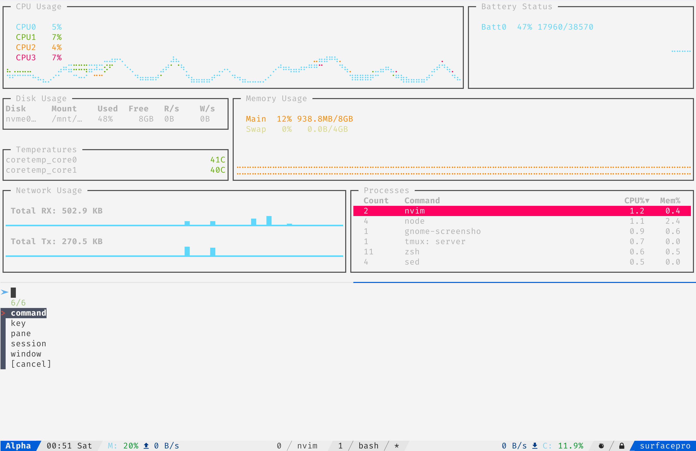

# Feature

- Manage sessions ( attach, detach*, rename, kill* ).
- Manage windows ( switch, link, move, swap, rename, kill* ).
- Manage panes ( switch, break, join*, swap, layout, kill* ).
- Multiple selection ( support for actions marked by * ).
- Search commands and append to command prompt.
- Search key bindings and execute.

# Installation

Suppose you are using [tpm](https://github.com/tmux-plugins/tpm/), add this line into your `$HOME/.tmux.conf`

```tmux
set -g @plugin 'sainnhe/tmux-fzf'
```

Reload configuration, then press `prefix` + `I`.

And of course, this plugin requires [fzf](https://github.com/junegunn/fzf/) to get it work.

# Usage

To launch tmux-fzf, press `prefix` + `F` (Shift+F).

This plugin supports multiple selection for some actions, you can press `TAB` and `Shift-TAB` to mark multiple items.

Most actions don't need to be explained, but there are some actions that might need to be explained here.

## link & move window

You can use **link** action to link a window from another session to current session.

launch tmux-fzf -> `window` -> `link` -> select a window in another session -> select destination

There are 3 available destinations:

`after`: link it after current window

`end`: link it to the last window in current session

`begin`: link it to the first window in current session

And you can use **kill** action to unlink or kill current window.

`kill` actually use `tmux unlink-window -k` instead of `tmux kill-window`. The main difference between `unlink-window -k` and `kill-window` is that `kill-window` will kill current window and all other windows linked to it, while `unlink-window -k` will only kill current window.

The logic of the `unlink -k` action is a bit like hard link in unix/linux. If the current window only exists in one session, then kill; if the current window exists in multiple sessions, then unlink.

BTW, if you want to bind a key to kill current window, I would recommend `unlink-window -k` instead of `kill`.

**move** action is similar to link, except the window at source window is moved to destination.

## break & join pane

**break** action will break source pane off from its containing window to make it the only pane in destination window.

launch tmux-fzf -> `pane` -> `break` -> select source pane -> select destination

There are 3 available destinations:

`after`: break it after current window

`end`: break it to the last window in current session

`begin`: break it to the first window in current session

**join** action is like split-window, but instead of splitting destination pane and creating a new pane, it will split it and move source pane into the current window. This can be used to reverse break-pane.

launch tmux-fzf -> `pane` -> `join` -> select source pane(s)

# Customization

## key binding

For example, to use `prefix` + `C-f` (Ctrl+F), add this line into your `$HOME/.tmux.conf`

```tmux
set -g @tmux-fzf-launch-key 'C-f'
```

## fzf behavior

This plugin will read fzf environment variables, so you can customize the behavior of fzf such as prompt and color by setting those variables.

For more information, check [official page of fzf](https://github.com/junegunn/fzf/#environment-variables).

In addition, this plugin supports options of `fzf-tmux` command which is [provided by fzf](https://github.com/junegunn/fzf#fzf-tmux-script), you can customize them by adding something like this into `$HOME/.tmux.conf`

```tmux
TMUX_FZF_OPTIONS="-d 35%"
```

To list all available `fzf-tmux` options, execute `fzf-tmux --help` in your shell.

## format

For some reasons, you may want to customize format of panes, windows, sessions listed in fzf. There are three variables to complete this work:

`TMUX_FZF_PANE_FORMAT`   `TMUX_FZF_WINDOW_FORMAT`   `TMUX_FZF_SESSION_FORMAT`

For example, `tmux list-panes -a` doesn't show running program and window name by default. If you want to show running program and window name, add something like this into `$HOME/.tmux.conf`

```tmux
TMUX_FZF_PANE_FORMAT="[#{window_name}] #{pane_current_command}  [#{pane_width}x#{pane_height}] [history #{history_size}/#{history_limit}, #{history_bytes} bytes] #{?pane_active,[active],[inactive]}"
```

Similarly, `TMUX_FZF_WINDOW_FORMAT` and `TMUX_FZF_SESSION_FORMAT` can also be handled in this way.

For more information, check "FORMATS" section in tmux manual.

